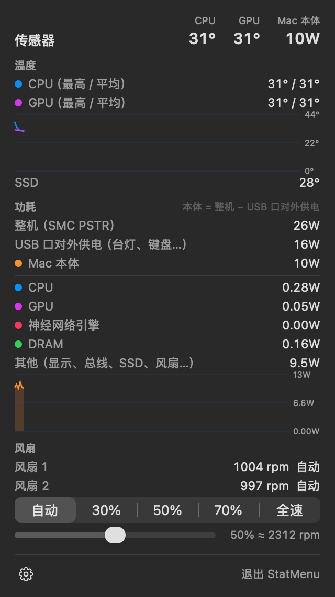

# fanctl + StatMenu

_Last updated: 2026-09-25_

> **EN TL;DR** — Fan control and an iStat-Menus-style menu bar monitor for Apple Silicon, written for a Mac Studio (M5 Max, `Mac17,14`, macOS 27) that iStat Menus 7.50, Macs Fan Control and TG Pro did not support yet. `fanctl` is a C CLI plus a small root LaunchDaemon (`fanctld`) that sets fan speed through the SMC, with a thermal guard (any CPU/GPU sensor > 100 °C → fans to max, released below 85 °C). `StatMenu` is an unprivileged SwiftUI menu bar app: CPU, GPU and memory usage **and** power, network rates, and temperatures plus the Mac's own power draw, each with a detail popover. Power is computed from IOReport energy counters over each counter's own hardware timestamps (dividing by the polling interval, as macmon does, makes CPU watts alternate between 0 and 2×). On M5 / macOS 27 the CPU/DRAM/ANE counters only advance while a root `powermetrics` samples, so the installer runs one as a second LaunchDaemon. Whole-system power is the SMC's `PSTR` (12 V DC side of the internal PSU), which **includes** what the USB ports supply to external devices; StatMenu subtracts that (`PU1C`+`PU2C`+`PU3C`+`PUAC`) to show the Mac's own draw. Only tested on one machine — sensor keys and the fan protocol may differ on other Macs. The UI is in Chinese.

写给 Mac Studio（M5 Max，`Mac17,14`，macOS 27）的风扇控制 + 菜单栏监控。当时 iStat Menus 7.50、Macs Fan Control、TG Pro 都还不支持这台机器，于是自己写了一个。

- **`fanctl`**：命令行（C），看温度、风扇、功耗，调风扇转速；配一个 root 后台服务 `fanctld`，装好后调速不再需要密码。
- **`StatMenu`**：菜单栏 app（SwiftUI，无需任何权限），从左到右显示 网络 / CPU / GPU / 内存 / 传感器：CPU、GPU、内存同时有**占用率和功耗**，网络是上下行速率，传感器是温度和 Mac 本体功耗。点开是详细面板（历史曲线、各核心、进程排行、风扇控制）。




> ⚠️ **只在一台机器上验证过**（Mac17,14，macOS 27）。温度传感器的 SMC 键、风扇协议在别的机型上可能不同。调风扇会写 SMC——后果自负。界面目前只有中文。

## 安装

需要 Xcode Command Line Tools（`xcode-select --install`），不需要完整 Xcode。

```sh
git clone https://github.com/Justaboringname/fanctl.git
cd fanctl
sudo ./install.sh              # 编译 + 安装 + 启动；以后更新也是这一条
sudo ./install.sh uninstall    # 卸载：风扇交还自动，删掉上表所有内容、app 设置和日志
```

`install.sh` 会装这些东西：

| 位置 | 作用 |
|---|---|
| `/Library/PrivilegedHelperTools/com.justaboringname.fanctld` | 后台服务运行的二进制（放在只有 root 能写的目录） |
| `/usr/local/bin/fanctl` | 同一个二进制，给命令行用（`/usr/local/bin` 已存在时不改它的属主） |
| `/Library/LaunchDaemons/com.justaboringname.fanctld.plist` | 风扇后台服务，读你的控制文件、执行调速和温度保护 |
| `/Library/LaunchDaemons/com.justaboringname.fanctld.power.plist` | 常驻 `powermetrics --samplers cpu_power -i 1000`，让 CPU/DRAM 能耗计数器保持刷新（原因见下文） |
| `~/Library/Application Support/fanctl/control` | 控制文件（你自己的文件，写 `auto` / `2000` / `50%`） |
| `/Applications/StatMenu.app` | 菜单栏 app（以你的身份运行，不需要权限） |

状态文件在 `/var/run/fanctl.status`，日志在 `/var/log/fanctld.log`。StatMenu 的齿轮菜单里可以开「登录时启动」。

## 命令行

```sh
fanctl                      # 温度（CPU/GPU 平均与最高）、风扇、功耗
fanctl watch [-i 秒]        # 实时刷新
fanctl set 2400             # 转速（rpm）；也可以写百分比：fanctl set 60%
fanctl auto                 # 交还系统自动控制
fanctl dump [前缀]          # 列出 SMC 键（调试用），如 fanctl dump PU
```

装了 `fanctld` 时 `set` / `auto` 不需要 sudo，设置会一直保持到你改回来。没装时需要 sudo，按 Ctrl-C 或 `--for 秒` 到期后自动交还；这时还可以用 `--guard °C` 改保护温度。

**温度保护**（`fanctld` 和 `sudo fanctl set` 都有）：任何一个 CPU/GPU 传感器超过 100 °C，风扇立刻全速；最热的传感器降到 85 °C 以下后恢复你的设定。读不到任何温度传感器时交还系统自动控制。

`fanctld` 另外还会：连续 3 次（每秒一次）读不到风扇状态时交还自动；睡眠前交还自动，唤醒 3 秒后重新应用你的设定。

## StatMenu

- **菜单栏**（从左到右）：`NET ↑上传 ↓下载`、`CPU 占用 功耗`、`GPU 占用 功耗`、`MEM 占用 功耗(DRAM)`、传感器（CPU/GPU 最高温度 + Mac 本体功耗）。手动调速时温度计图标变成风扇。
- **面板**：历史曲线（鼠标悬停或拖动，显示该点的数值和距今多久）；CPU 按簇（M5 Max：6 个超级核心 + 12 个性能核心）分列占用和功耗，各核心占用柱状图；占用最高、耗电最多、内存最多的进程；GPU 渲染/分块器利用率和显存；内存压力、交换、压缩；网络会话累计流量；风扇状态、预设档位和滑条。
- 刷新间隔 1 / 2 / 5 秒可选。数据采集在后台线程；菜单栏图像没变化就不重绘（每次更新都要消耗 macOS MenuBarAgent 的 CPU）。

## 功耗是怎么测的（踩过的坑）

**1. 按硬件时间戳算，不按轮询间隔。** CPU/GPU/DRAM/ANE 功耗来自 IOReport 的 “Energy Model” 能耗计数器（普通权限可读）。每个计数器自带更新时间戳，而且各自按自己的节奏批量更新（CPU/DRAM 约 1–2 秒一批，GPU 实时）。拿两次读数的差除以*轮询间隔*（macmon 的做法）会让 CPU 功耗在 0 和 2 倍之间来回跳；这里一律用计数器自己的时间戳差（`power_rate.h`，有单元测试）。间隔不到 0.25 秒的更新会并入下一个窗口，避免偶发的 10 ms 窄窗口造成尖峰。

**2. M5 / macOS 27 上，CPU/DRAM/ANE 计数器要有 root 的 `powermetrics` 在跑才会动。** 这个是卸掉 iStat Menus 之后才发现的：之前 CPU 功耗一直正常，只是因为 iStat 的后台一直开着 `powermetrics`。实测：
- 没有 `powermetrics` 时，`CPU Energy` 的时间戳可以停在几十分钟前一动不动；GPU 不受影响。
- `sudo powermetrics --samplers cpu_power -i 1000` 一开，立刻每 1.02 秒刷新一次，一关就停。
- 用 IOReport 订阅**全部**约 1.1 万个通道并采样，root 或普通权限都**刷新不了**（`tools/triggerscan.c`）。`powermetrics` 自己也只开了 3 个 IOReportUserClient，没有打开其他服务，具体怎么触发的还没弄清。

所以安装脚本单独装了一个 LaunchDaemon 跑 `powermetrics`，输出丢弃。代价约为单核 2.4%（整机 18 核的 0.13%）。不装它，CPU、内存（DRAM）、神经网络引擎功耗和「其他」一栏都显示「–」，命令行里是 N/A。

**3. 整机功耗（SMC `PSTR`）包含 USB 口对外供电。** `PSTR` ≈ `PDTR` = `VD0R` × `ID0R`，是内置电源 12 V 直流输出那一侧（不含电源本身的转换损耗，插座上会再多一点）。它把 USB 口给外设的电也算进去了：把一盏接在 USB-C 口上、约 14 W 的台灯关掉 30 秒，`PSTR` 从 25.9 W 掉到 10.9 W（`PU1C` 从 14.1 W 掉到 0.3 W），多出的约 1 W 是 12 V→5 V 的转换损耗。所以 StatMenu 显示的「Mac 本体」= `PSTR` −（`PU1C`+`PU2C`+`PU3C`+`PUAC`）：
- `PU1C` = `V5SC`（5.2 V）× `IU1C`，对应后面 USB-C 1–2 口（用台灯验证过）；`PU2C` 对应 3–4 口（和各口的 `DnJV`×`DnJI` 对得上）；`PU3C` / `PUAC` 推测是前面的 USB-C 和 USB-A（仅按命名推测，空载约 0.03 W）。
- 这台机器空闲时 Mac 本体约 10–11 W（显示器开着）。苹果官方给的 M5 Max Mac Studio 空闲值是 7 W（插座端，只开 Finder，不接外设）。
- Studio Display XDR 自带交流电源，不从 Mac 取电（接它的口 `D1JV` = 0 V），它的功耗 Mac 这边读不到。

**4. 其他。** 网络字节计数器对没有特殊授权的进程只给 32 位（macOS 27 上只有 `netstat` 有 `com.apple.private.network.statistics`），所以只显示本次运行的累计流量。进程的 CPU 时间和能耗来自 `proc_pid_rusage`，普通权限只能读自己的进程。

## 实现要点

- **风扇协议（M5，没有 `Ftst` 解锁键）**：`F<i>md = 1` 进手动，`F<i>Tg` 写目标转速（小端 float）；回自动 = `F<i>md = 0` 再把 `F<i>Tg` 写回 `F<i>Mn`。`md` 的回读约有 1 秒延迟，所以所有退出路径都无条件写回自动。
- **温度**：CPU = 18 个 `Tp0*`，GPU = 84 个 `Tg*`（加压测试对出来的：全核 CPU 负载拉高 `Tp0*` 9–12 °C，GPU 负载拉高 `Tg*` 10–20 °C），SSD 来自 IOHID 的 “NAND CH0 temp”。
- **后台服务的安全性**：`fanctld` 以 root 运行，只读一个属于你的控制文件（`O_NOFOLLOW`、只接受普通文件、单链接、属主必须和目录属主一致），只接受 `auto` / 转速 / 百分比。StatMenu 和它之间只通过这个文件和 `/var/run/fanctl.status` 通信。
- **SwiftUI 只用 Command Line Tools 编译**：macOS 27 SDK 里 `@State` / `@Observable` 是宏，宏插件只随完整 Xcode 提供，所以全部用 `ObservableObject`。

## 开发

```sh
make fanctl      # 命令行
make app         # build/StatMenu.app
make test        # 功耗计算 + 后台服务逻辑（内存里的假 SMC，不碰硬件）
make render      # 把所有面板离屏渲染成 build/render/*.png（浅色/深色）
make metricsdump # 每秒打印一遍所有指标，用来和 macmon / vm_stat / netstat 对照
make tools       # 诊断工具：energyprobe、triggerscan、smcsample
```

| 文件 | 内容 |
|---|---|
| `smc.c` / `smc.h` | AppleSMC 读写 |
| `metrics.c` / `metrics.h` | CPU、功耗（IOReport）、GPU、内存、网络、传感器、进程 |
| `power_rate.h` | 按硬件时间戳计算功耗 |
| `fanctl.c` | 命令行 + `fanctld` |
| `app/` | StatMenu（SwiftUI + AppKit 状态栏） |
| `tests/` | `power_rate` 单元测试；`fanctld` 逻辑测试（`fake_smc.c`） |
| `tools/` | `metricsdump`、`render`、`energyprobe`、`triggerscan`、`smcsample`、`powerlog.sh` |

`make render` 的网络、CPU、内存面板会显示本机的局域网 IP 和正在运行的程序，拿去当截图前先看一眼。

## License

MIT
